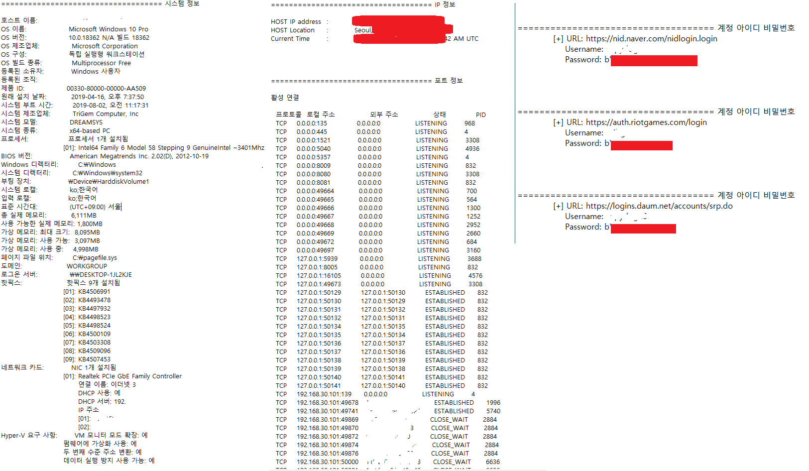

# 컴퓨터 내에 저장된 정보추출

***
## 1. 주요기능
- 시스템 정보 추출
- IP 정보 추출
- 포트 정보 추출
- Chrome에 저장된 아이디, 비밀번호 추출
- 추출된 데이터를 ftp를 이용해 서버로 전송
***
## 2. 설명
※ 해당 PC에서 실행했을 경우를 전제하에 짜여졌으며 간단한 정보 추출을 프로그램화한 것으로 레지스터값을 바꿔
   원격 데스크톱을 활용하거나 포트를 열거나 추가적인 작업이 가능하다.
- systeminfo를 통한 시스템 정보 추출
- 사설 IP와 인터넷 접속을 통한 공인 IP 정보 추출
- netstat -ano를 통한 포트 정보 추출
- 코드를 통해 Chrome의 개인정보가 담긴 파일을 찾아내어 추출 및 복호화를 통해 아이디, 비밀번호 추출
- 코드를 통해 ftp로 자동으로 전송하게 한다.
